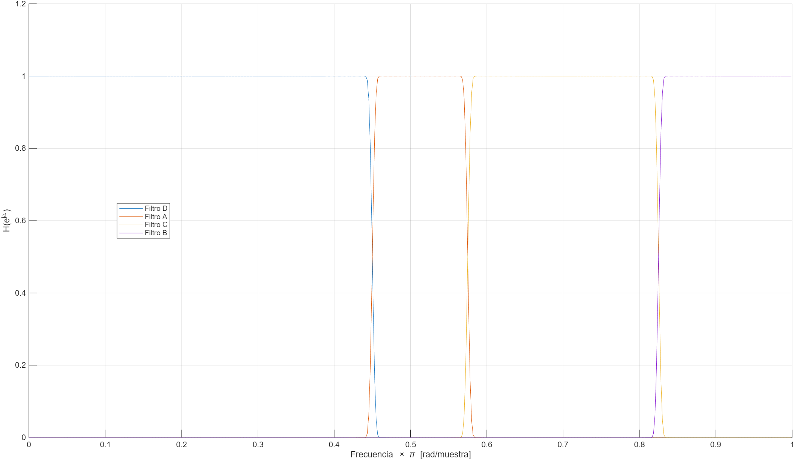
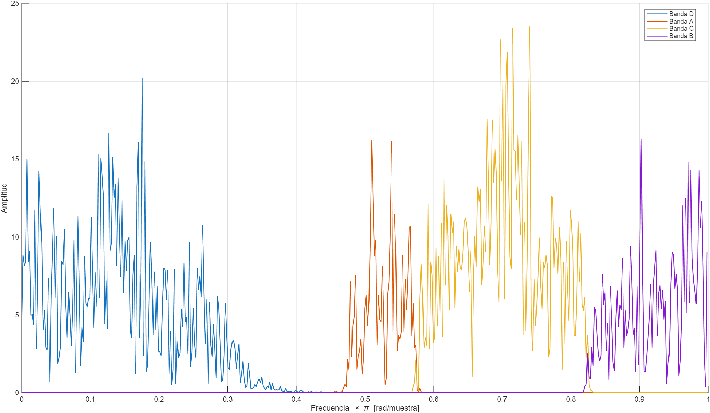
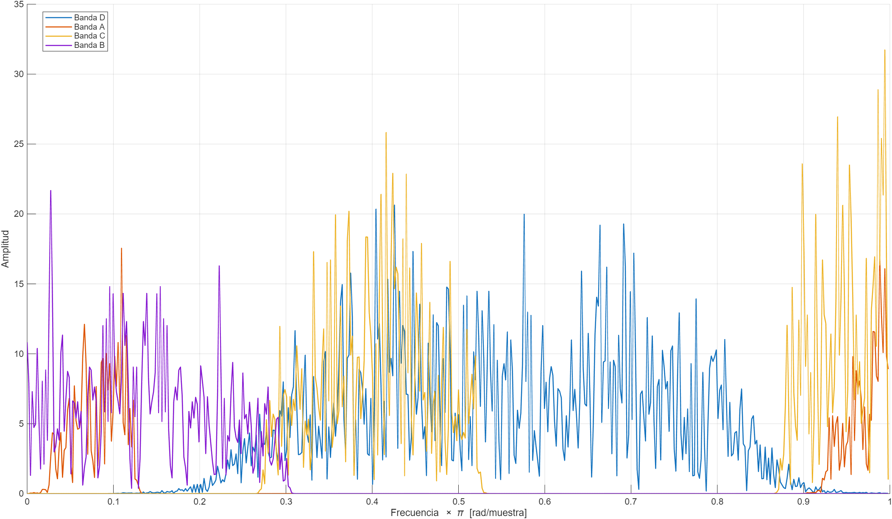
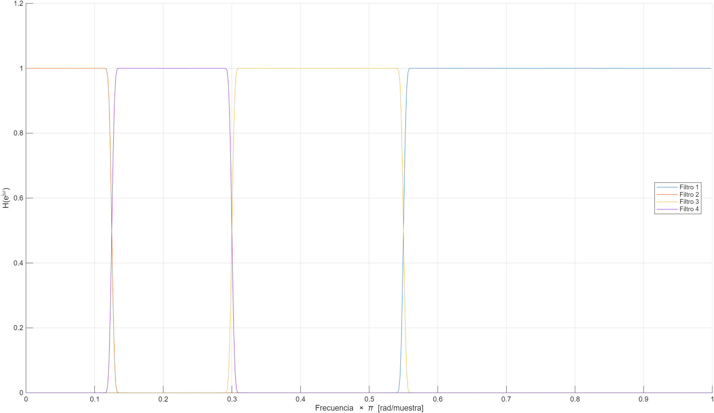
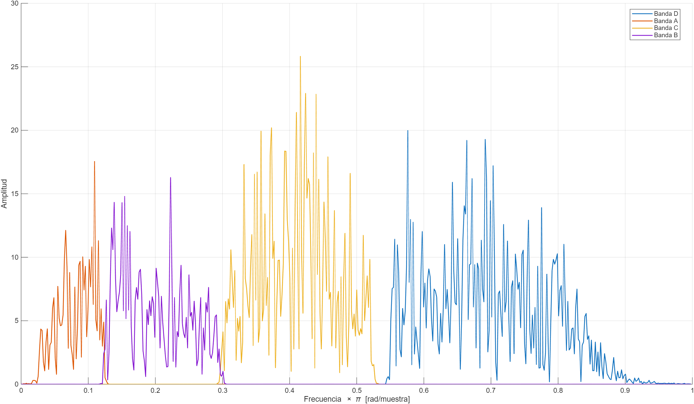
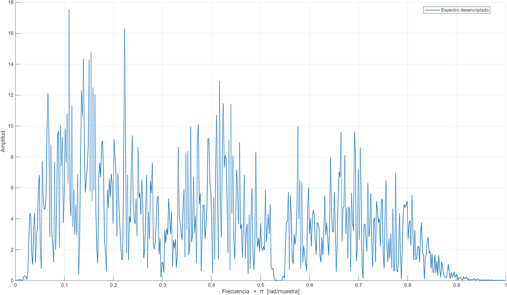

# Tarea 8
Falconieri - Kromberger

---
La siguiente figura muestra la respuesta en freciencia de los cuatro filtros H_n usados para limpiar cada banda de frecuencia despúes de haber sido desplazada a su posición correspondiente

La siguiente figura muestra el espectro frecuencial de la señal de audio encriptada **IN.xe**.

La siguiente figura muestra el espectro de la señal de audio encriptada desplazado y superpuesto.

En la siguiente imagen se puede ver la respuesta en frecuencia de los filtros una vez se aplica el desplazamiento.

La siguiente figura grafica el espectro de la señal desplazada y filtrada.

La siguiente figura muestra el espectro de la señal desplazada, filtrada y ajustada en ganancia.

